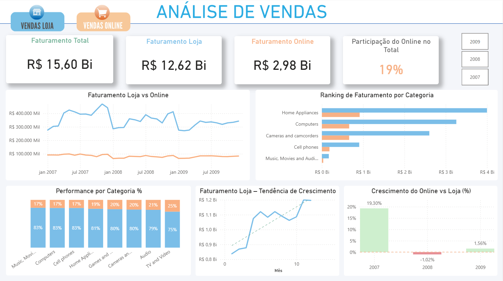
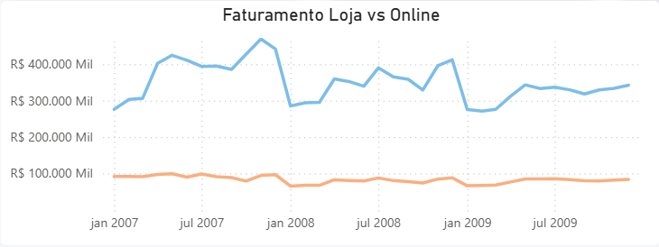
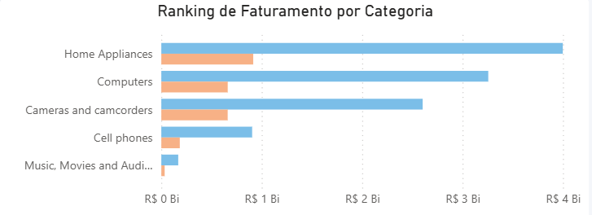
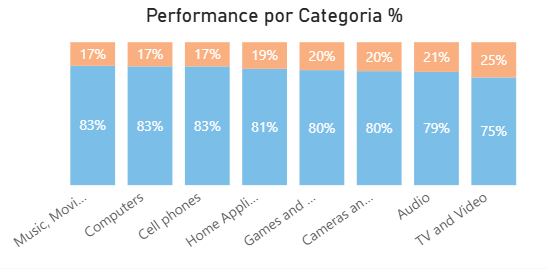
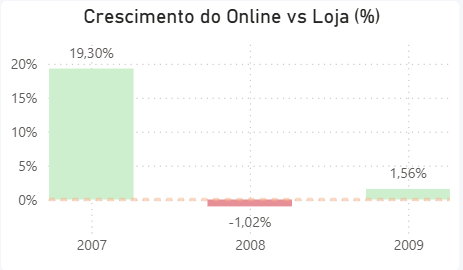

# Projeto: Análise de Vendas – Loja Física vs Online

Teste o projeto => <a href="https://app.powerbi.com/view?r=eyJrIjoiNDdjZGZjMjctNDNkNS00NWYwLThhOGEtZDQ3ZGY1MmM1MzFjIiwidCI6ImIyYjI2MzY2LWRhNmEtNGNkOS1hMzI4LTNmNWI3NzljZGI4MiJ9&pageName=d7bbc0981f7c5fe3cce6" target="_blank">aqui</a>

## ➡️ Objetivo do Projeto

* Analisar e comparar o desempenho de vendas da loja física vs vendas online, identificando:

* Evolução do faturamento ao longo do tempo

* Participação do canal online no faturamento total

* Diferenças de performance por categoria de produto

* Tendências de crescimento e variação percentual entre os canais

### O objetivo é apoiar a tomada de decisão estratégica, respondendo perguntas de negócio como:
> O canal online está ganhando ou perdendo relevância?  
> Quais categorias performam melhor no online vs loja física?

## Contexto de Negócio

A empresa atua com vendas em dois canais:

🏪 Loja Física

🌐 Loja Online

A gestão precisa entender:

* Se o canal online está crescendo de forma sustentável

* Quais categorias impulsionam o faturamento

* Onde concentrar investimentos e esforços comerciais

## ➡️ Ferramentas Utilizadas

1. Power BI
2. Power Query (tratamento e modelagem dos dados)
3. DAX (medidas e indicadores)
4. Modelagem Dimensional (Star Schema)

## ➡️ Dataset e Modelagem de Dados

[Dataset: Contoso Microsoft](https://www.microsoft.com/en-us/download/details.aspx?id=18279)

O modelo foi estruturado em estrela, com:

### Tabelas Fato

* Fato Vendas Loja

* Fato Vendas Online

### Tabelas Dimensão

* Dim Calendário

* Dim Produto

* Dim Categoria

### Essa abordagem garante:

* Melhor performance

* Facilidade na criação de medidas

* Escalabilidade do modelo

## ➡️ Principais Métricas Criadas (DAX)

* Faturamento Loja

* Faturamento Online

* Faturamento Total

* Participação do Online no Total (%)

* Variação % do Faturamento Online em relação à Loja

* Ranking de Faturamento por Categoria

* Tendência de Crescimento Mensal

Exemplo de medida:
~~~bash
Participação Online (%) =
DIVIDE(
    [Faturamento Online],
    [Faturamento Total]
)
~~~

## ➡️ Visão Geral do Dashboard
Esta seção apresenta o dashboard consolidado, permitindo uma visão macro do desempenho
de vendas por canal, ao longo do tempo e por categoria.

> **O que é possível identificar nesta visão:**
> - Receita total por canal
> - Comparação temporal entre loja física e online
> - Categorias com maior participação nas vendas
> - Indicadores de crescimento ou retração

---

## 📈 Evolução das Vendas – Loja Física vs Online
Análise da evolução das vendas ao longo do tempo, comparando os dois canais.

**Insight principal:**  
A loja física concentra a maior parte do faturamento, porém apresenta maior volatilidade ao longo do período analisado.
O canal online, apesar de representar um volume menor de vendas, demonstra comportamento mais estável, com variações menos acentuadas ao longo do tempo.

---

## 🏆 Top 5 Categorias por Receita
Identificação das cinco categorias com maior faturamento no período.

**Insight principal:**  
Poucas categorias concentram a maior parte da receita total.

---

## 📦 Mix de Vendas por Canal e Categoria
Análise da distribuição percentual das vendas entre os canais por categoria.

**Insight principal:**  
O canal online possui participação relativamente baixa em todas as categorias, variando aproximadamente entre 17% e 25%, enquanto a loja física domina o faturamento em todo o portfólio.
Apesar disso, observa-se que categorias como TV and Video e Audio apresentam maior penetração do online, indicando maior propensão digital nesses segmentos.

---

## 📉 Variação Percentual – Online vs Loja Física
Comparação percentual de desempenho entre os canais.

**Insight principal:**  
O canal online apresentou crescimento relativo superior ao da loja física em 2007 e 2009, com destaque para 2007, quando o online cresceu significativamente mais.
Em 2008, observa-se uma reversão pontual, com desempenho do online ligeiramente inferior ao da loja, indicando um período de desaceleração ou ajuste.

---

## 🧾 Conclusões e Recomendações
Síntese dos principais aprendizados e possíveis ações de negócio.

- Reforçar investimentos no canal online nas categorias com menos saídas
- Avaliar estratégias de recuperação do canal online
- Monitorar continuamente categorias com variação negativa

De forma geral, o projeto demonstra que o canal online atua atualmente como complementar à loja física, mas apresenta oportunidades claras de crescimento, 
especialmente em categorias com maior participação digital e alto volume de faturamento. Esses insights podem apoiar decisões estratégicas relacionadas à priorização de investimentos, 
campanhas de marketing digital e expansão do e-commerce.

## 👤 Autor

Edimilson de Sousa  
Analista de Dados em formação  
Foco em Power BI, DAX e análise de negócios
