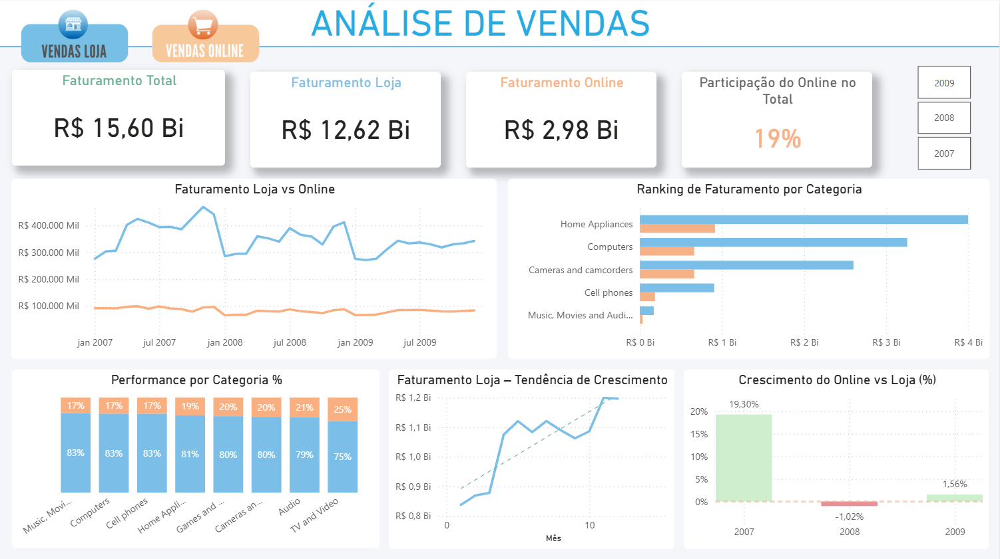
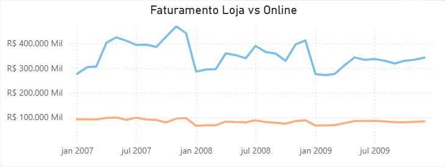
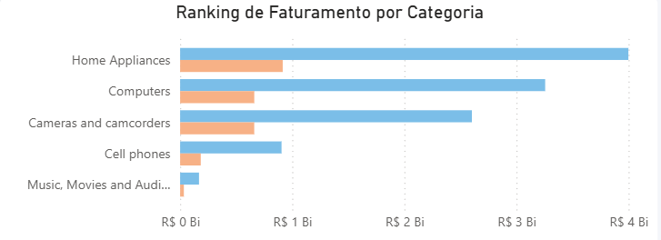
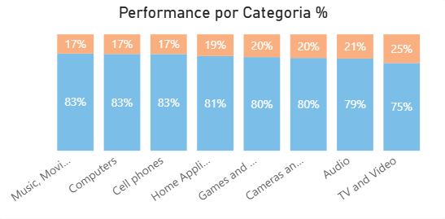
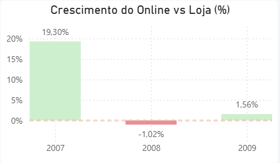
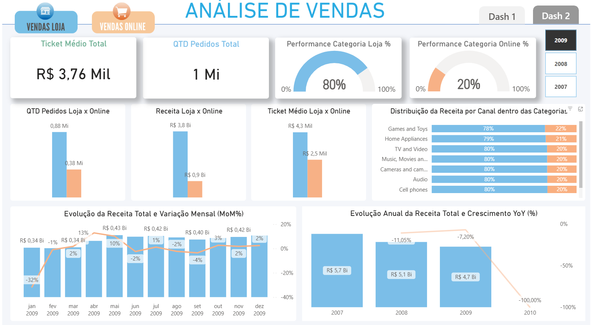
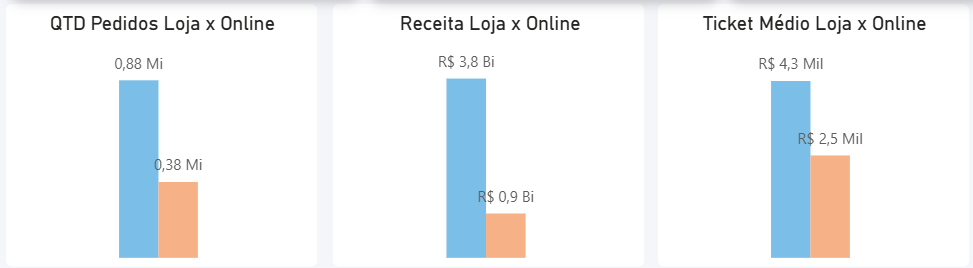
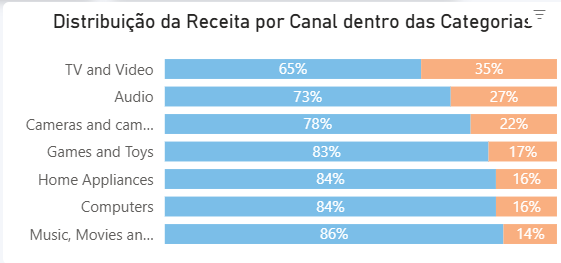
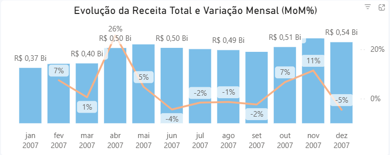
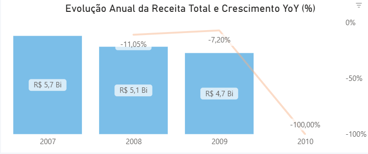

# Projeto: Análise de Vendas – Loja Física vs Online

### Dashboard do projeto => <a href="https://app.powerbi.com/view?r=eyJrIjoiNDdjZGZjMjctNDNkNS00NWYwLThhOGEtZDQ3ZGY1MmM1MzFjIiwidCI6ImIyYjI2MzY2LWRhNmEtNGNkOS1hMzI4LTNmNWI3NzljZGI4MiJ9&pageName=d7bbc0981f7c5fe3cce6" target="_blank">aqui</a>

## ➡️ Objetivo do Projeto

💡Analisar e comparar o desempenho de vendas da loja física vs vendas online, identificando:

 🔹Evolução do faturamento ao longo do tempo  
 🔹Participação do canal online no faturamento total  
 🔹Diferenças de performance por categoria de produto  
 🔹Tendências de crescimento e variação percentual entre os canais  

### O objetivo é apoiar a tomada de decisão estratégica, respondendo perguntas de negócio como:
👉🏽 O canal online está ganhando ou perdendo relevância?  

👉🏽 Quais categorias performam melhor no online vs loja física?

## Contexto de Negócio

 A empresa atua com vendas em dois canais:
 
 🏪 Loja Física

 🌐 Loja Online

 A gestão precisa entender:
 
  🔹Se o canal online está crescendo de forma sustentável  
  
  🔹Quais categorias impulsionam o faturamento  
  
  🔹Onde concentrar investimentos e esforços comerciais  

## ➡️ Ferramentas Utilizadas

1. Power BI
2. Power Query (tratamento e modelagem dos dados)
3. DAX (medidas e indicadores)
4. Modelagem Dimensional (Star Schema)

## ➡️ Dataset e Modelagem de Dados

[Dataset: Contoso Microsoft](https://www.microsoft.com/en-us/download/details.aspx?id=18279)

O modelo foi estruturado em estrela, com:

### Tabelas Fato
🔹Fato Vendas Loja  

🔹Fato Vendas Online

### Tabelas Dimensão

🔹Dim Calendário 

🔹Dim Produto

🔹Dim Categoria

## ➡️ Principais Métricas Criadas (DAX)

🔹Faturamento Loja

🔹Faturamento Online

🔹Faturamento Total

🔹Participação do Online no Total (%)

🔹Variação % do Faturamento Online em relação à Loja

🔹Ranking de Faturamento por Categoria

🔹Tendência de Crescimento Mensal

---
## ➡️ Visão Geral do Dashboard 1
Esta seção apresenta o dashboard consolidado, permitindo uma visão macro do desempenho
de vendas por canal, ao longo do tempo e por categoria.

> **O que é possível identificar nesta visão:**
> - Receita total por canal
> - Comparação temporal entre loja física e online
> - Categorias com maior participação nas vendas
> - Indicadores de crescimento ou retração

---

## 📈 Evolução das Vendas – Loja Física vs Online
Análise da evolução das vendas ao longo do tempo, comparando os dois canais.

**Insight principal:**  
A loja física concentra a maior parte do faturamento, porém apresenta maior volatilidade ao longo do período analisado.
O canal online, apesar de representar um volume menor de vendas, demonstra comportamento mais estável, com variações menos acentuadas ao longo do tempo.

---

## 🏆 Top 5 Categorias por Receita
Identificação das cinco categorias com maior faturamento no período.

**Insight principal:**  
Poucas categorias concentram a maior parte da receita total.

---

## 📦 Mix de Vendas por Canal e Categoria
Análise da distribuição percentual das vendas entre os canais por categoria.

**Insight principal:**  
O canal online possui participação relativamente baixa em todas as categorias, variando aproximadamente entre 17% e 25%, enquanto a loja física domina o faturamento em todo o portfólio.
Apesar disso, observa-se que categorias como TV and Video e Audio apresentam maior penetração do online, indicando maior propensão digital nesses segmentos.

---

## 📉 Variação Percentual – Online vs Loja Física
Comparação percentual de desempenho entre os canais.

**Insight principal:**  
O canal online apresentou crescimento relativo superior ao da loja física em 2007 e 2009, com destaque para 2007, quando o online cresceu significativamente mais.
Em 2008, observa-se uma reversão pontual, com desempenho do online ligeiramente inferior ao da loja, indicando um período de desaceleração ou ajuste.

---

## ➡️ Dashboard 2 – Indicadores Operacionais e Dinâmica de Crescimento
Enquanto o primeiro dashboard foca na comparação estrutural entre canais e categorias, 
o segundo painel aprofunda a análise sob a ótica operacional, explorando:

> - Ticket médio
> - Volume de pedidos
> - Receita por canal
> - Evolução mensal (MoM)
> - Crescimento anual (YoY)

---
## 📈 Comparações Operacionais

### QTD Pedidos – Loja vs Online
 🔹Evidencia que a loja física concentra maior volume de pedidos, reforçando sua predominância operacional.

### Receita – Loja vs Online
🔹Confirma que o faturamento acompanha o volume transacional, mantendo a loja física como principal canal.

### Ticket Médio – Loja vs Online
🔹Permite avaliar se o crescimento decorre de:
   * Mais pedidos
   * Ou maior valor médio por pedido

---
## 📊 Distribuição da Receita por Canal dentro das Categorias
🔹Este gráfico apresenta a composição percentual do faturamento por canal (Loja Física vs Online) dentro de cada categoria, 
permitindo avaliar o nível de penetração digital por segmento de produto.

---
## 📆 Evolução Mensal – Receita Total e MoM (%)
🔹Observa-se que, embora a receita apresente relativa estabilidade ao longo do ano, há oscilações mensais que indicam variações 
sazonais e possíveis impactos externos.

---
## 📅 Evolução Anual – Receita Total e Crescimento YoY (%)
🔹Há tendência de redução da receita total entre 2007 e 2009, acompanhada de variação negativa no crescimento anual.
  Isso sugere:
   * Possível desaceleração do negócio
   * Necessidade de revisão estratégica
   * Potencial de fortalecimento do canal online para compensação

---
## 🧾 Conclusões e Recomendações
Síntese dos principais aprendizados e possíveis ações de negócio.

- Reforçar investimentos no canal online nas categorias com menos saídas
- Avaliar estratégias de recuperação do canal online
- Monitorar continuamente categorias com variação negativa

De forma geral, o projeto demonstra que o canal online atua atualmente como complementar à loja física, mas apresenta oportunidades claras de crescimento, 
especialmente em categorias com maior participação digital e alto volume de faturamento. Esses insights podem apoiar decisões estratégicas relacionadas à priorização de investimentos, 
campanhas de marketing digital e expansão do e-commerce.

---
## 👤 Autor

Edimilson de Sousa  
Analista de Dados em formação  
Foco em Power BI, DAX e análise de negócios
