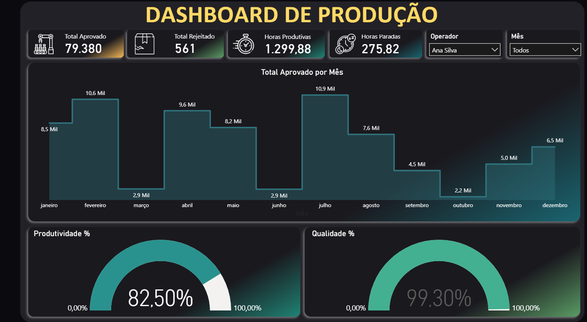

# 🗂️Dashboard de Produção Industrial

### 🚀 Dashboard do projeto => <a href="https://app.powerbi.com/groups/me/reports/7e73690d-c95d-438c-83e6-6255aabe94b1/82332fd671e3e58c4808?experience=power-bi" target="_blank">aqui</a>

## Visão Geral
Este projeto foi desenvolvido como estudo pessoal com foco em prática de modelagem de dados e construção de métricas em DAX no Power BI.

O dashboard simula um cenário real de monitoramento industrial, permitindo acompanhar indicadores de produtividade, qualidade e eficiência operacional 
com base em dados reais extraídos de uma base em Excel.

## Objetivo do Projeto:
🔹Qual o volume total produzido?  
🔹Qual o índice de rejeição?  
🔹Como está a eficiência operacional?  
🔹Quanto tempo está sendo perdido com paradas?  
🔹A qualidade do processo está dentro do esperado?  
🔹Existe variação de desempenho ao longo dos meses?  
O foco foi construir um dashboard com visão executiva e operacional ao mesmo tempo.

## ➡️ Ferramentas Utilizadas

1. Power BI
2. Power Query (tratamento e modelagem dos dados)
3. DAX (medidas e indicadores)

## ➡️ Dataset e Modelagem de Dados
[Dataset: Excell interno](.....)

## ➡️ Indicadores Principais

🔹Total Aprovado

🔹Total Rejeitado

🔹Horas Produtivas

🔹Horas Paradas

🔹Produtividade %

🔹Qualidade %

## ➡️ Visão Geral do Dashboard 

## 📊 Estrutura do Dashboard
🔹 KPIs Executivos

O topo do dashboard apresenta os principais indicadores consolidados:

🔹Total produzido e rejeitado

🔹Horas produtivas e paradas

🔹Filtros por operador e mês

🔹Isso permite visão rápida do desempenho geral da operação.

## ➡️ Análise Temporal

O gráfico "Total Aprovado por Mês" permite identificar:

🔹Sazonalidade produtiva

## ➡️ Eficiência Operacional

Indicador de Produtividade (%) mostra o quanto das horas trabalhadas foram efetivamente produtivas.

Um índice de 82,5% indica espaço para otimização operacional.

🔹Meses com maior eficiência

🔹Quedas de produção

🔹Tendência de recuperação

## ➡️ Controle de Qualidade

🔹O indicador de Qualidade (%) evidencia um alto padrão operacional (99,3%), indicando baixo índice de retrabalho e desperdício.

## 🧾 Conclusões

Este projeto reforça competências em:

🔹Construção de métricas operacionais

🔹Estruturação de indicadores de eficiência

🔹Aplicação prática de DAX

🔹Transformação de dados operacionais em visão gerencial

🔹Trata-se de um estudo focado em análise industrial, com abordagem orientada à melhoria contínua e tomada de decisão baseada em dados.

## 👤 Autor

Edimilson de Sousa  
Analista de Dados em formação  
Foco em Power BI, DAX e análise de negócios
