# 🛒 Marketplace Review Intelligence

> Análise de **202.785 avaliações** de consumidores em produtos de beleza e cuidados capilares no Mercado Livre, do scraping à inteligência de negócio em um dashboard interativo no Power BI.

<p align="center">
  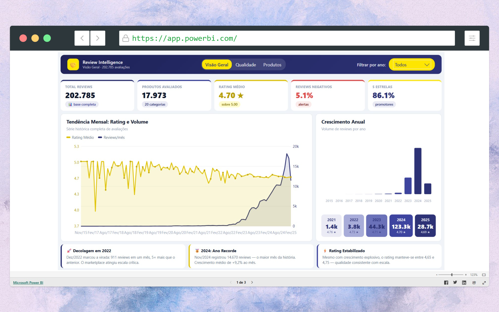
</p>

*Dashboard final construído inteiramente em Power BI, com identidade visual do Mercado Livre. Três páginas de storytelling — Visão Geral, Qualidade & Sentimento e Produtos & Categorias — navegáveis por abas e filtráveis por ano, com todos os gráficos renderizados em SVG via DAX puro.*

---

## 📌 Sumário

- [Sobre o projeto](#-sobre-o-projeto)
- [Stack e ferramentas](#-stack-e-ferramentas)
- [A pergunta de negócio](#-a-pergunta-de-negócio)
- [Arquitetura do projeto](#-arquitetura-do-projeto)
- [Etapa 1 — Diagnóstico dos dados](#-etapa-1--diagnóstico-e-junção-do-dataset)
- [Etapa 2 — Limpeza e tratamento](#-etapa-2--limpeza-e-tratamento-python--pandas)
- [Etapa 3 — Análise de sentimento](#-etapa-3--análise-de-sentimento)
- [Etapa 4 — Modelagem dimensional](#-etapa-4--modelagem-dimensional-star-schema)
- [Etapa 5 — Medidas DAX](#-etapa-5--medidas-dax-em-destaque)
- [Etapa 6 — Dashboard](#-etapa-6--o-dashboard)
- [Principais insights](#-principais-insights)
- [Desafios técnicos e soluções](#-desafios-técnicos-e-soluções)
- [Como reproduzir](#-como-reproduzir)
- [Autor](#-autor)

---

## 🎯 Sobre o projeto

Este projeto percorre o ciclo completo de um caso de dados real: **da coleta bruta de avaliações públicas do Mercado Livre até a entrega de um dashboard executivo**. O objetivo foi transformar texto não estruturado de milhares de consumidores em métricas acionáveis sobre satisfação, qualidade percebida e performance de categorias no nicho de beleza e cuidados capilares.

| | |
|---|---|
| **Volume analisado** | 202.785 avaliações |
| **Período** | 2015 – 2025 |
| **Produtos** | 17.973 |
| **Categorias** | 20 |
| **Fonte** | Mercado Livre (dados públicos) |
| **Entrega final** | Dashboard Power BI de 3 páginas |

---

## 🧰 Stack e ferramentas

| Etapa | Ferramenta |
|---|---|
| diagnóstico e junção dos dados | Python |
| Tratamento | Python · Pandas · NumPy · Jupyter Notebook |
| Análise de sentimento | Python · processamento de linguagem natural |
| Modelagem | Power BI Desktop · Star Schema |
| Métricas e visuais | DAX · HTML Content Visual · SVG |
| Documentação | GitHub |

---

## ❓ A pergunta de negócio

> *"O que 200 mil consumidores estão realmente dizendo sobre produtos de beleza no Mercado Livre — e onde estão as oportunidades e os riscos de qualidade?"*

O projeto se organiza em torno de três eixos de investigação, que viram as três páginas do dashboard:

1. **Volume e crescimento** — como o engajamento evoluiu ao longo do tempo?
2. **Qualidade e sentimento** — os clientes estão satisfeitos? Qual o NPS?
3. **Produtos e categorias** — quais categorias se destacam e quais exigem atenção?

---

## 🏗 Arquitetura do projeto

*Pipeline de ponta a ponta: Dataset Mercado livre em (.json), o Python limpa e enriquece os dados com score de sentimento, os dados são modelados em star schema no Power BI, e o DAX transforma tudo em métricas e gráficos.*

```
Dataset Mercado livre (.json)
        │
        ▼
[ Limpeza · Pandas/Jupyter ]──► deduplicação, normalização, tipagem
        │
        ▼
[ Análise de Sentimento ]──► sentimento_score + classificação
        │
        ▼
[ Modelagem · Power BI ]──► Star Schema (1 fato + 3 dimensões)
        │
        ▼
[ DAX + HTML/SVG ]──► Dashboard de 3 páginas
```

---

## 🔍 Etapa 1 — Diagnóstico e Junção do dataset

<p align="center">
  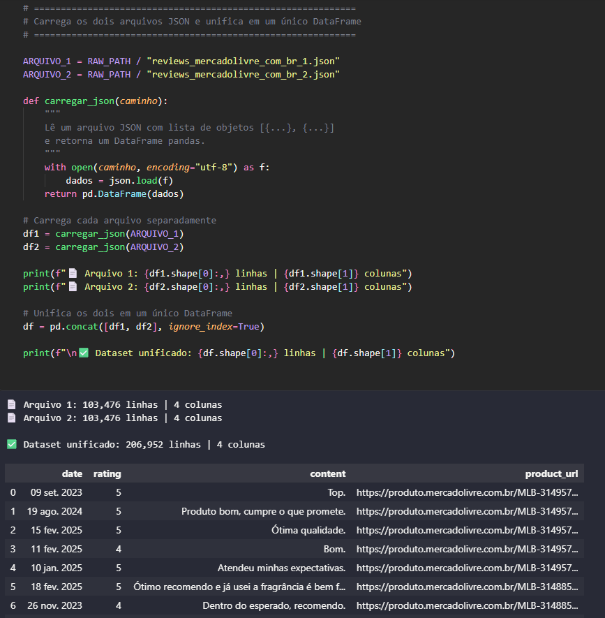
</p>

*Notebook responsável pela coleta. O scraper percorre as páginas de produtos de beleza e cuidados capilares do Mercado Livre, extraindo para cada avaliação: nota (1–5), texto do comentário, data e produto associado.*

> 💡 **Decisão de projeto:** O primeiro passo foi entender os dados, carregando os dados brutos, unificando os dois arquivos JSON e gerando um diagnóstico completo da qualidade dos dados antes de qualquer transformação.

---

## 🧹 Etapa 2 — Limpeza e tratamento (Python / Pandas)

*Estado dos dados antes. A base bruta continha duplicatas, datas em formatos inconsistentes, textos com ruído (HTML, emojis, espaçamento) e registros sem nota.*

<p align="center">
  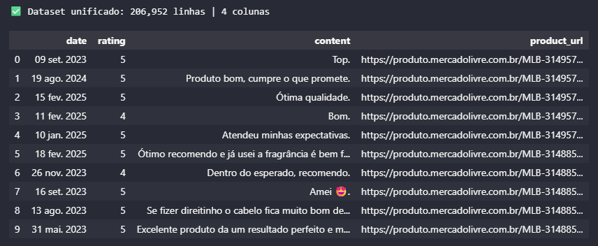
</p>

E depois do tratamento. 

<p align="center">
  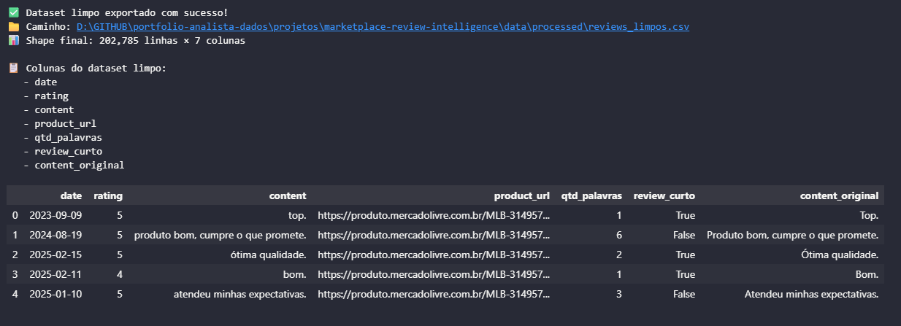
</p>

As principais transformações aplicadas:

- **Deduplicação** de avaliações idênticas coletadas em paginações sobrepostas
- **Normalização de datas** para um formato único, viabilizando a dimensão de calendário
- **Limpeza textual** dos comentários (remoção de tags, normalização de espaços e caixa)
- **Tipagem e validação** — notas convertidas para inteiro, registros inválidos descartados
- **Engenharia de atributos** — criação de `qtd_palavras` e flag `review_curto` para análises de profundidade do feedback

---
<p align="center">
  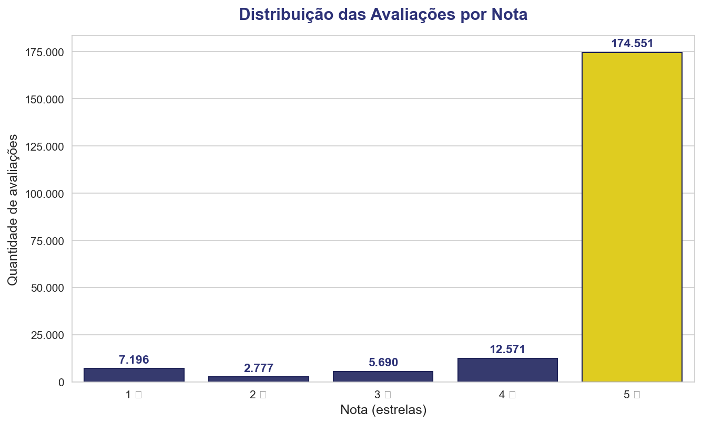
</p>

*Distribuição das notas após a limpeza. A forte concentração em 5 estrelas (≈86%) já antecipava um dos achados centrais: a base é majoritariamente positiva — o que exigiu cuidado para que as análises não escondessem os sinais de insatisfação na cauda.*

---

## 💬 Etapa 3 — Análise de sentimento

<p align="center">
  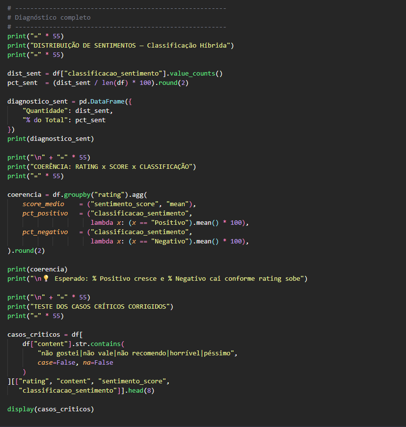
</p>

*Cada comentário recebeu um `sentimento_score` contínuo (de -1 a +1) e uma classificação em três faixas. A polaridade textual complementa a nota numérica — um cliente pode dar 4 estrelas e ainda assim escrever um comentário neutro ou crítico.*

| Classificação | Faixa de score | Significado |
|---|---|---|
| 🟢 Positivo | score > 0,05 | Cliente satisfeito |
| 🟡 Neutro | -0,05 ≤ score ≤ 0,05 | Sem polaridade clara |
| 🔴 Negativo | score < -0,05 | Cliente insatisfeito |

> 💡 **Por que cruzar nota e sentimento?** A nota diz *quanto* o cliente gostou; o sentimento textual diz *o que* ele sentiu. Juntos, revelam inconsistências valiosas — como categorias com nota alta mas comentários mornos.

---

## 🗄 Etapa 4 — Modelagem dimensional (Star Schema)

<p align="center">
  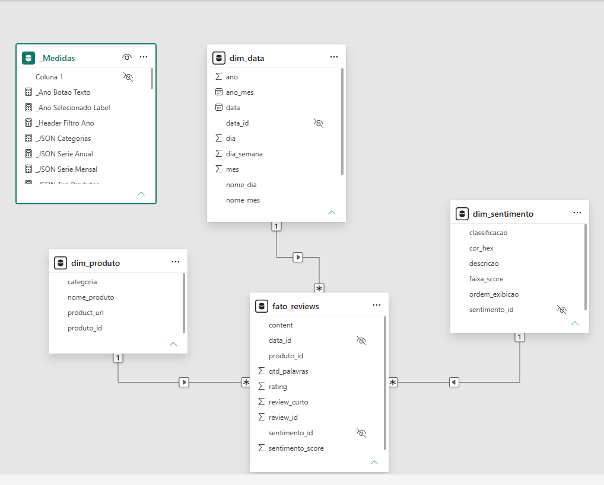
</p>

*Modelo em estrela: uma tabela fato central (`fato_reviews`) conectada a três dimensões. Esse desenho mantém o modelo leve, as relações simples e o desempenho do DAX otimizado.*

| Tabela | Tipo | Conteúdo |
|---|---|---|
| `fato_reviews` | Fato | review_id, rating, sentimento_score, qtd_palavras, chaves |
| `dim_produto` | Dimensão | produto, categoria, URL |
| `dim_data` | Dimensão | calendário completo (dia, mês, ano, trimestre…) |
| `dim_sentimento` | Dimensão | classificação, faixa de score, cor |

> 💡 **Decisão de modelagem:** isolei o sentimento em sua própria dimensão (`dim_sentimento`) com cor e descrição embutidas, permitindo que a semântica da classificação viva no modelo — não espalhada por medidas.

---

## 🧮 Etapa 5 — Medidas DAX em destaque

Todo o cálculo — KPIs, gráficos e até as coordenadas dos SVGs — é feito em DAX. Abaixo, as medidas mais relevantes do projeto.

### NPS Aproximado

Adapta a metodologia de Net Promoter Score para a escala de avaliações: trata notas 5 como promotores e notas ≤ 2 como detratores.

```dax
NPS Aproximado =
VAR Promotores =
    CALCULATE( COUNTROWS( fato_reviews ), fato_reviews[rating] = 5 )
VAR Detratores =
    CALCULATE( COUNTROWS( fato_reviews ), fato_reviews[rating] <= 2 )
VAR Total = [Total Reviews]
RETURN
    DIVIDE( Promotores - Detratores, Total, 0 ) * 100
```

> **Resultado: NPS ≈ 81** — pontuação classificada como "Excelente" em qualquer benchmark de e-commerce.

### Score Médio de Sentimento

```dax
Score Médio Sentimento =
AVERAGE( fato_reviews[sentimento_score] )
```

> **Resultado: ≈ 0,50** numa escala de -1 a +1 — confirmando uma base marcadamente positiva, em linha com o NPS.

### % Reviews 5 Estrelas

```dax
% Reviews 5 Estrelas =
DIVIDE( [Reviews 5 Estrelas], [Total Reviews], 0 )
```

> **Resultado: ≈ 86%** das avaliações são nota máxima.

---

## 📊 Etapa 6 — O dashboard

O dashboard final tem **três páginas navegáveis**, header unificado com abas e filtro de ano, identidade visual do Mercado Livre (azul `#2D3277` e amarelo `#FFE600`) e tooltips informativos em todos os gráficos.

### Página 1 — Visão Geral

<p align="center">
  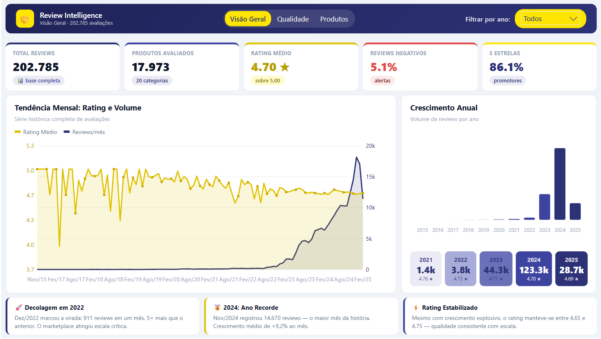
</p>

*A página de abertura conta a história do crescimento: 5 KPIs de topo, a curva de evolução mensal de volume e rating, o crescimento anual e cards de insight. É aqui que se vê a "decolagem" do marketplace a partir de 2022.*

### Página 2 — Qualidade & Sentimento

<p align="center">
  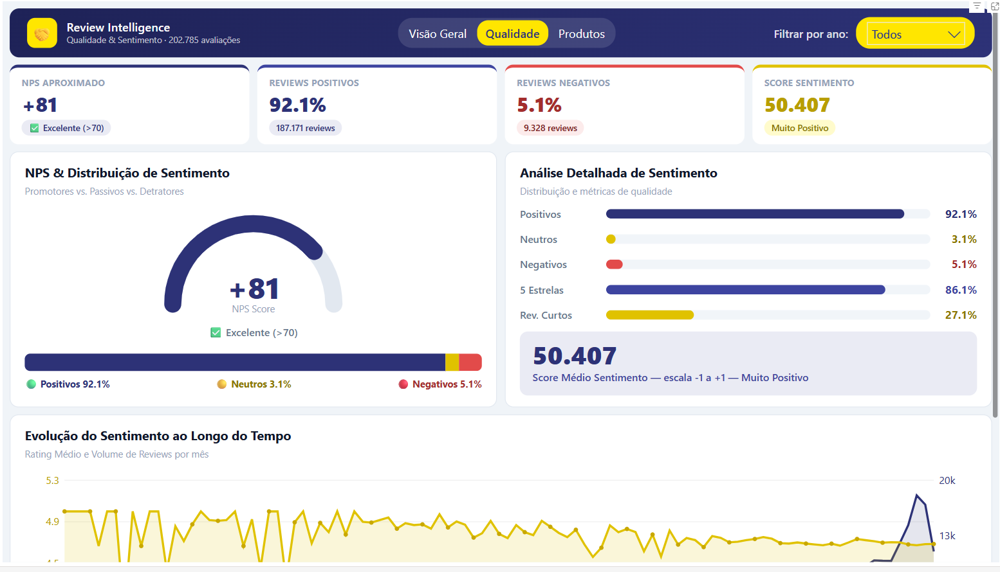
</p>

*O coração analítico: gauge de NPS, distribuição de sentimento (positivo/neutro/negativo), métricas detalhadas de qualidade e a evolução temporal do sentimento. As três faixas de sentimento mantêm cores semânticas (verde/amarelo/vermelho) mesmo na paleta ML.*

### Página 3 — Produtos & Categorias

<p align="center">
  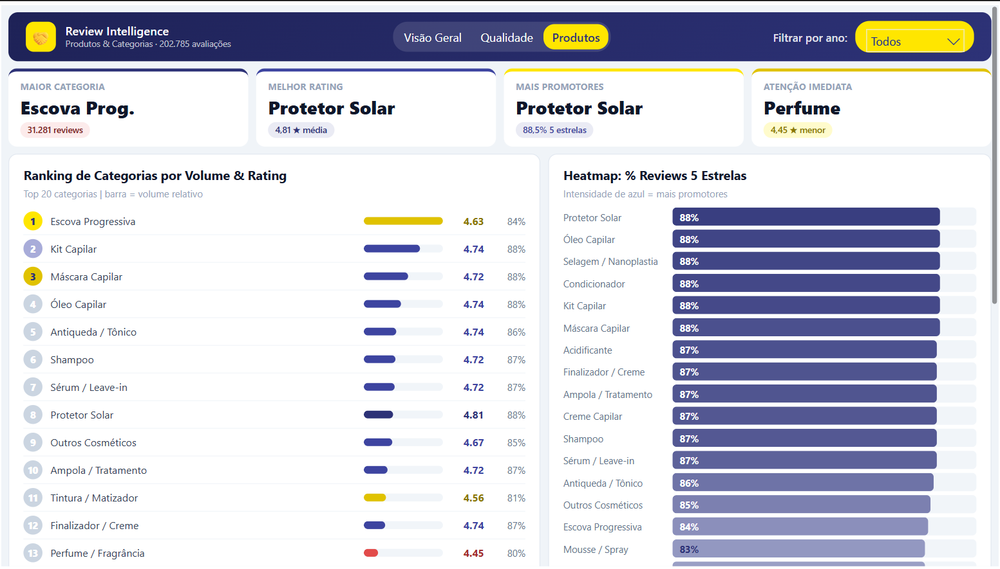
</p>

*A análise competitiva: ranking das 20 categorias por volume e rating, heatmap de % de 5 estrelas e top 10 produtos. Identifica as "joias escondidas" (alta nota, baixo volume) e os pontos críticos de qualidade.*

---

## 💡 Principais insights

<p align="center">
  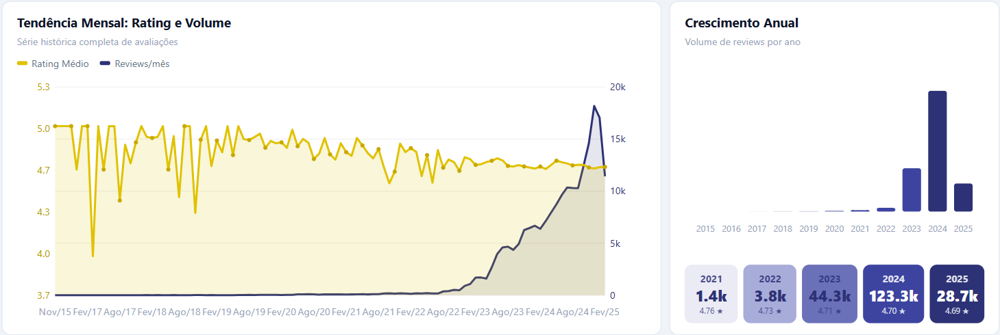
</p>

**1. A decolagem de 2022.** Até 2021 o volume de avaliações era residual. Dez/2022 marcou a virada com um salto de 5× sobre o mês anterior, e **2024 fechou como ano recorde** com mais de 120 mil avaliações — uma curva de crescimento exponencial.

**2. Satisfação alta e consistente.** Mesmo com o crescimento explosivo, o rating médio se manteve estável entre 4,65 e 4,75. Um NPS de ≈81 e score de sentimento de ≈0,50 confirmam uma base muito satisfeita.

**3. A joia escondida — Protetor Solar.** A categoria mais bem avaliada (rating 4,81, 88,5% de 5 estrelas) **não é a de maior volume** — um claro sinal de oportunidade de crescimento.

**4. Pontos de atenção.** Perfume (4,45) e Tintura/Matizador (4,56) ficaram abaixo da média geral, indicando categorias que merecem investigação de qualidade.

**5. Negatividade cresce com escala.** A proporção de avaliações negativas subiu de 2,5% (2021) para 4,6% (2024) — natural com o aumento de volume, mas um indicador a monitorar.

---

## 🔄 Como reproduzir

```bash
# 1. Clone o repositório
git clone https://github.com/edimilsonbraz/marketplace-review-intelligence.git

# 2. Instale as dependências do Python
pip install -r requirements.txt

# 3. Execute os notebooks na ordem
#    notebooks/01_coleta.ipynb
#    notebooks/02_limpeza.ipynb
#    notebooks/03_sentimento.ipynb

# 4. Abra o dashboard
#    dashboard/marketplace_review_intelligence.pbix no Power BI Desktop
```

> ⚠️ **Nota sobre os dados:** os dados foram coletados de páginas públicas do Mercado Livre para fins exclusivamente educacionais e de portfólio. Nenhum dado pessoal foi coletado.

---

## 👤 Autor

**Edimilson Braz** — Análise de Dados & Business Intelligence

*Projeto de portfólio cobrindo o ciclo completo de dados: scraping, limpeza, análise de sentimento, modelagem dimensional e visualização executiva.*

---

<p align="center">
  <i>⭐ Se este projeto te foi útil ou interessante, considere deixar uma estrela no repositório.</i>
</p>
